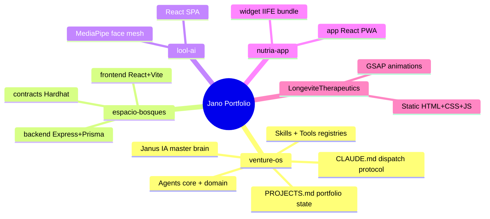
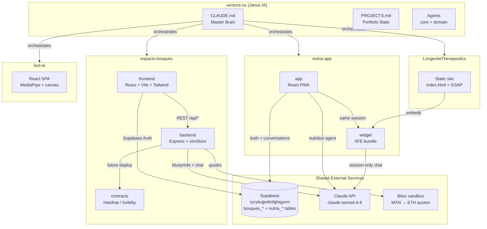

# Portfolio Mind Map
## Jano's Venture OS — Repo Interaction Map
_Last updated: April 2026_

---

## Structure — all repos at a glance

---

## Interactions — data flows and shared services

---

## Per-repo quick reference

| Repo | Type | Stack | External deps | Status |
|---|---|---|---|---|
| **venture-os** | Orchestrator | Markdown + agents | GitHub MCP, Gmail, GCal, Notion | Always active |
| **espacio-bosques** | Community funding platform | React · Express · Prisma · Hardhat | Supabase, Claude API, Bitso | POC complete |
| **lool-ai** | B2B virtual try-on widget | React · MediaPipe | None (standalone) | Core widget done |
| **nutria-app** | Nutrition AI — app + widget | React · Supabase · Claude API | Supabase, Claude API | Build phase |
| **LongeviteTherapeutics** | Clinic website | Static HTML · GSAP | nutria-app widget | V2 built, not deployed |

---

## Shared infrastructure

| Service | Project ref | Used by | Table prefix |
|---|---|---|---|
| Supabase | `rycybujjedtofghigyxm` | espacio-bosques, nutria-app | `bosques_*`, `nutria_*` |
| Claude API | `claude-sonnet-4-6` | espacio-bosques (blueprints), nutria-app (agent) | — |
| Bitso sandbox | sandbox API | espacio-bosques | — |

**Rule:** All credentials live in `salasoliva27/dotfiles` and are injected as env vars into every Codespace. Never hardcode in any repo.

---

## How the repos relate

- **venture-os** is the brain — it doesn't run code, it orchestrates all others
- **nutria-app widget** embeds into **LongeviteTherapeutics** via `<script src="widget.js">`
- **espacio-bosques** is fully self-contained (frontend + backend + contracts), shares only Supabase and Claude
- **lool-ai** is standalone — no backend, no auth, no shared services yet
- **Supabase** is the only shared database — table prefixes prevent collisions between projects

---

## Test endpoints (simulation mode)

All backends in dev must expose `/api/test/*`. See `scripts/test-api.sh` in each repo.

| Endpoint | What it tests |
|---|---|
| `GET /api/test` | List all test endpoints |
| `GET /api/test/state` | Dump current store state |
| `POST /api/test/invest` | Simulate an investment (100 MXN min) |
| `POST /api/test/reset` | Reset sim data to seed |
