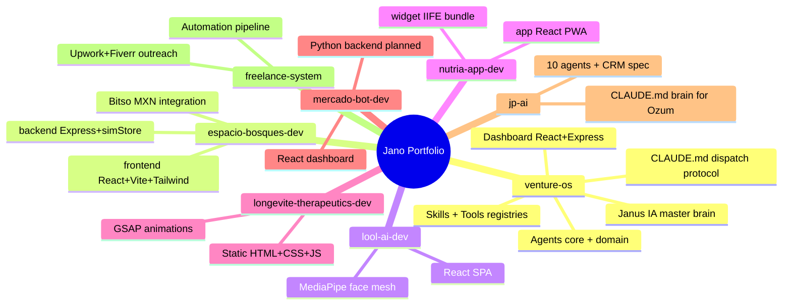

# Portfolio Mind Map
## Jano's Venture OS — Repo Interaction Map
_Last updated: April 2026_

---

## Structure — all repos at a glance

---

## Interactions — data flows and shared services

---

## Per-repo quick reference

| Repo | Type | Stack | External deps | Status |
|---|---|---|---|---|
| **venture-os** | Orchestrator + Dashboard | Markdown + agents + React + Express | GitHub, Gmail, Supabase, Brave, Obsidian MCPs | Always active |
| **espacio-bosques-dev** | Community funding platform | React · Express · Tailwind · Supabase Auth | Supabase, Claude API, Bitso | POC complete |
| **lool-ai-dev** | B2B virtual try-on widget | React · MediaPipe | None (standalone) | Core widget done |
| **nutria-app-dev** | Nutrition AI — app + widget | React · Supabase · Claude API | Supabase, Claude API | V1 built, needs deploy |
| **longevite-therapeutics-dev** | Clinic website | Static HTML · GSAP | nutria-app widget | V2 built, not deployed |
| **mercado-bot-dev** | Prediction market bot | React dashboard · Python backend | Claude API | Dashboard v1, backend pending |
| **jp-ai** | AI-OS for Ozum events | CLAUDE.md + 10 agents | Supabase (ozum_*), Claude API | Setup complete, CRM pending |
| **freelance-system** | Freelance automation | Pipeline + portfolio | Upwork, Fiverr | Operational, needs leads |

---

## Shared infrastructure

| Service | Project ref | Used by | Table prefix |
|---|---|---|---|
| Supabase | `rycybujjedtofghigyxm` | venture-os, espacio-bosques, nutria-app, jp-ai | `janus_*`, `eb_*`, `nutria_*`, `ozum_*` (pending) |
| Claude API | `claude-sonnet-4-6` | espacio-bosques, nutria-app, mercado-bot, jp-ai | — |
| Bitso sandbox | sandbox API | espacio-bosques | — |
| Cloudflare R2 | `janus-media` bucket | lool-ai, longevite (planned) | — |

**Rule:** All credentials live in `salasoliva27/dotfiles` and are injected as env vars into every Codespace. Never hardcode in any repo.

---

## How the repos relate

- **venture-os** is the brain — it doesn't run code, it orchestrates all others
- **nutria-app widget** embeds into **longevite-therapeutics-dev** via `<script src="widget.js">`
- **espacio-bosques** is fully self-contained (frontend + backend + contracts), shares only Supabase and Claude
- **lool-ai** is standalone — no backend, no auth, no shared services yet
- **Supabase** is the only shared database — table prefixes prevent collisions between projects

---

## Test endpoints (simulation mode)

All backends in dev must expose `/api/test/*`. See `scripts/test-api.sh` in each repo.

| Endpoint | What it tests |
|---|---|
| `GET /api/test` | List all test endpoints |
| `GET /api/test/state` | Dump current store state |
| `POST /api/test/invest` | Simulate an investment (100 MXN min) |
| `POST /api/test/reset` | Reset sim data to seed |

## Vault connections
- [[CLAUDE]] · [[PROJECTS]] · [[wiki/index]]
- [[wiki/espacio-bosques]] · [[wiki/lool-ai]] · [[wiki/nutria]] · [[wiki/longevite]] · [[wiki/mercado-bot]] · [[wiki/jp-ai]] · [[wiki/freelance-system]]
