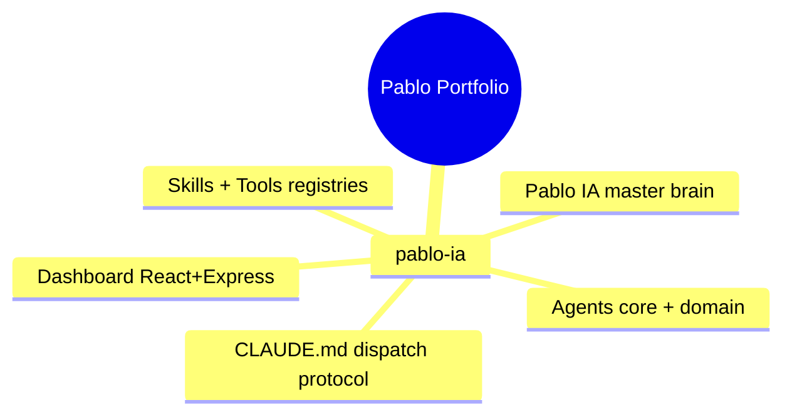
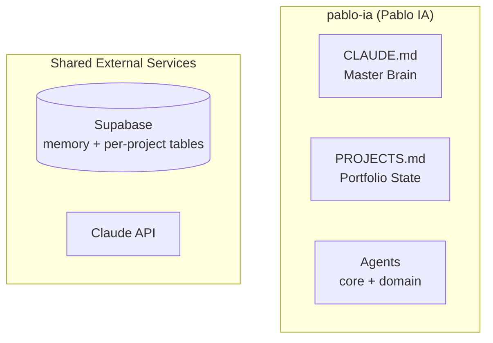

# Portfolio Mind Map
## Pablo's Venture OS — Repo Interaction Map
_Last updated: April 2026_

_(This is a blank-slate template. Personalize during discovery — `run discovery` in chat — as projects are added.)_

---

## Structure — all repos at a glance

_(Add child nodes per product repo as they come online.)_

---

## Interactions — data flows and shared services

_(Add product subgraphs and arrows as repos are spun up. Each product declares which shared services it uses.)_

---

## Per-repo quick reference

| Repo | Type | Stack | External deps | Status |
|---|---|---|---|---|
| **pablo-ia** | Orchestrator + Dashboard | Markdown + agents + React + Express | GitHub, Supabase, Brave, Obsidian MCPs | Always active |

_(Add rows per product repo as they are created.)_

---

## Shared infrastructure

| Service | Project ref | Used by | Table prefix |
|---|---|---|---|
| Supabase | TBD | pablo-ia | `memories`, `janus_memories` |
| Claude API | TBD | pablo-ia | — |

**Rule:** All credentials live in the dotfiles repo and are injected as env vars into every Codespace. Never hardcode in any repo.

---

## How the repos relate

- **pablo-ia** is the brain — it doesn't run code, it orchestrates all others
- **Supabase** is the shared database — table prefixes prevent collisions between projects

_(Expand as products are added: cross-product embeds, shared auth, shared media.)_

---

## Test endpoints (simulation mode)

All backends in dev must expose `/api/test/*`. See `scripts/test-api.sh` in each repo.

| Endpoint | What it tests |
|---|---|
| `GET /api/test` | List all test endpoints |
| `GET /api/test/state` | Dump current store state |
| `POST /api/test/reset` | Reset sim data to seed |

## Vault connections
- [[CLAUDE]] · [[PROJECTS]]
